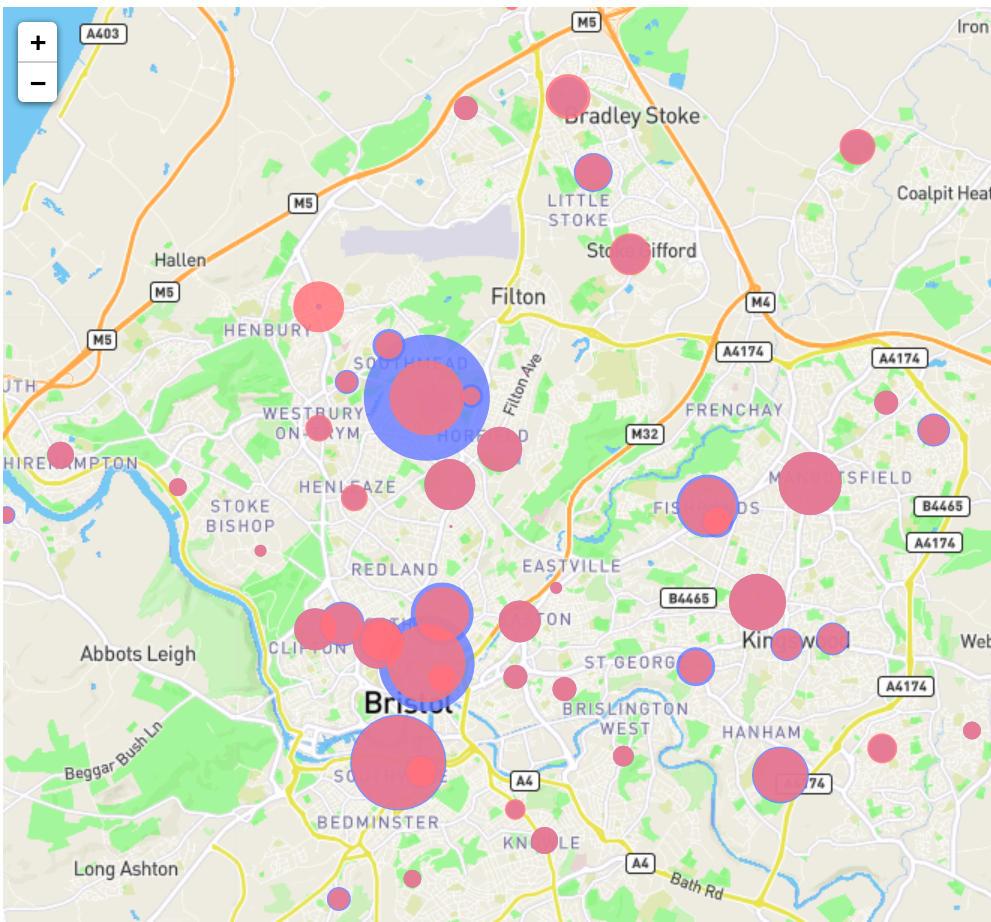

# WellbeingJam2020

A visualisation to map the flow of patients between different health services in Bristol. Visit https://davehenryjones.github.io/pave/ to see it in action.

> NOTE: We have updated the use case to reflect the current Covid-19 pandemic. We are now focusing on mapping capacity vs admissions in such services.

>NOTE: The data used is purely for illustrative purposes and does not currently reflect real values for capacity and admission data.

#### Latest Release - v0.1.0

  - Displays local services in correct position on map
  - Size of red circle is proportional to the number of patients who used the service
  - Size of blue circle is proportional to a dummy value for the capacity of that service

> 
> Dummy capacity vs admission data (for illustrative purposes only)
