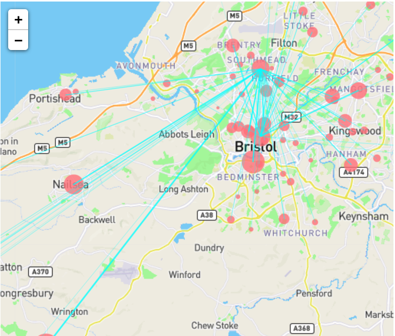
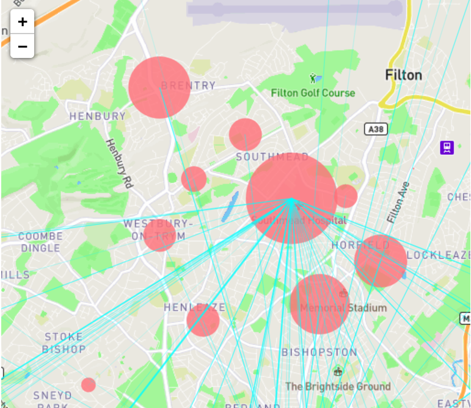

# WellbeingJam2020

A visualisation to map the flow of patients between different health services in Bristol

#### Latest Release

  - Displays local services in correct position on map
  - Size of circle is proportional to the number of patients who used the service
  - Lines between services indicate referrals between services
  - Thickness of the lines is proportional to the number of referrals

> 
> Zoomed out map with data plotted

 

> 
> Zoomed in map with data plotted

### Usage

#### Apache2 Server

The Apache2 Server is used to allow the reading of .csv & .json files into d3.js. Therefore it must be downloaded to run the application on a local machine.

> Ubuntu Instructions (Mac & Windows coming soon!)

- Download Apache2 with `sudo apt update && apt install apache2`
- Test that this has worked by typing `localhost` into your web browser

#### Running the application

- To run the website move the copy all the source code from `src/public/` into `/var/www/html`. You will need root privelages to do this.
- Got to `localhost` in your web browser to see the website.

### Developmers Guide

#### Releases & Versioning Semantics

vX.Y.Z such as v0.1.0 as the intial release. Based on the [ASDF Standard](https://asdf-standard.readthedocs.io/en/stable/versioning.html).

> - X : Major Release i.e. major change that reduces or removes backwards compatability e.g. a new data schema
> - Y : Minor Release i.e. new functionality added, major bug fixes
> - Z : Patch i.e. small change to documentation or codebase, minor bug fixes

Accompanying documentation for each release will follow [this guide](https://rollout.io/blog/best-practices-when-versioning-a-release/) from the Rollout Blog.
